# WebRTC ビデオ通話アプリケーション

ReactフロントエンドとNode.jsバックエンドで構築されたWebRTCを利用したビデオ通話アプリケーションです。

## 🚀 特徴

- **リアルタイム通信**: WebRTCによる高品質な音声・映像通話
- **モダンスタック**: React 18 + TypeScript 5 + Node.js 20 LTS
- **高速開発**: Vite による高速な開発サーバー
- **型安全**: TypeScript による完全な型安全性
- **リアルタイム**: Socket.io による安定したシグナリング
- **テスト**: Jest による包括的なテストカバレッジ

## 📋 技術スタック

### フロントエンド
- **React 18.x** - UIライブラリ
- **TypeScript 5.x** - 型安全な開発
- **Vite** - 高速な開発サーバー
- **Socket.io Client** - リアルタイム通信

### バックエンド
- **Node.js 20.x LTS** - サーバーランタイム
- **Express.js 4.x** - Webフレームワーク
- **Socket.io 4.x** - WebSocket実装
- **TypeScript 5.x** - 型安全な開発

### WebRTC関連
- **ブラウザ標準WebRTC API** - ピアツーピア通信
- **Google Public STUN** - NAT穿越（開発用）
- **MediaStream API** - メディア管理

## 🛠️ 環境構築

### 前提条件

- Node.js 20.x LTS以上
- npm 10.x以上
- macOS（推奨）
- HTTPS対応ブラウザ（WebRTC要件）

### 1. クローンと依存関係のインストール

```bash
# リポジトリをクローン
git clone <repository-url>
cd webrtc

# 全プロジェクトの依存関係をインストール
npm run install:all
```

### 2. 環境変数の設定

バックエンド用の環境変数ファイルを作成：

```bash
# backend/.env
PORT=3001
NODE_ENV=development
FRONTEND_URL=http://localhost:5173
STUN_SERVER=stun:stun.l.google.com:19302
JWT_SECRET=your-jwt-secret-key-here
LOG_LEVEL=info
```

### 3. 開発サーバーの起動

```bash
# 方法1: 全体を同時起動（推奨）
npm run dev

# 方法2: 個別起動
npm run dev:backend    # バックエンド (ポート3001)
npm run dev:frontend   # フロントエンド (ポート5173)
```

### 4. 動作確認

- **フロントエンド**: http://localhost:5173
- **バックエンド**: http://localhost:3001
- **ヘルスチェック**: http://localhost:3001/health

## 🧪 テスト

```bash
# 全プロジェクトのテスト実行
npm run test:all

# 個別テスト実行
npm run test:frontend  # フロントエンドテスト
npm run test:backend   # バックエンドテスト
```

## 🏗️ ビルド

```bash
# 全プロジェクトのビルド
npm run build:all

# 個別ビルド
npm run build:frontend  # フロントエンドビルド
npm run build:backend   # バックエンドビルド
```

## 📁 プロジェクト構造

```
webrtc/
├── frontend/              # React フロントエンド
│   ├── src/
│   │   ├── components/    # UIコンポーネント
│   │   ├── hooks/         # カスタムフック
│   │   ├── services/      # WebRTC、Socket.io関連
│   │   ├── types/         # TypeScript型定義
│   │   └── utils/         # ユーティリティ関数
│   ├── package.json
│   └── vite.config.ts
├── backend/               # Node.js バックエンド
│   ├── src/
│   │   ├── routes/        # APIルート
│   │   ├── services/      # ビジネスロジック
│   │   ├── socket/        # Socket.ioハンドラー
│   │   ├── types/         # TypeScript型定義
│   │   └── utils/         # ユーティリティ関数
│   ├── package.json
│   └── tsconfig.json
├── shared/                # 共通型定義・ユーティリティ
├── .github/workflows/     # GitHub Actions CI/CD
├── .cursorrules          # 開発ルール
└── README.md
```

## 📊 アプリケーションの処理フロー

### システム全体のアーキテクチャ

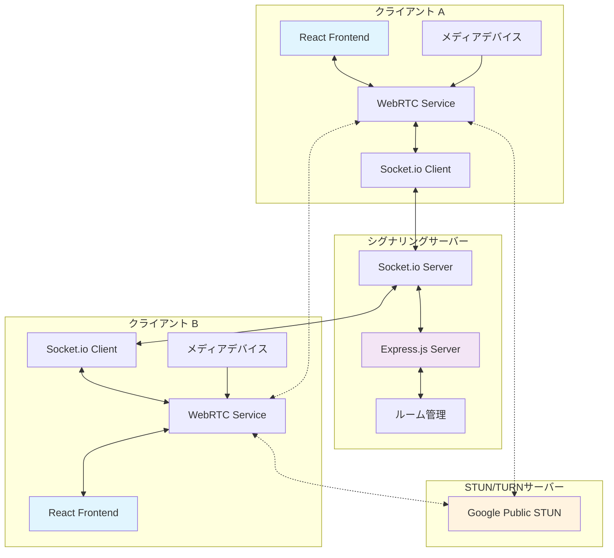

### 1. アプリケーション初期化フロー

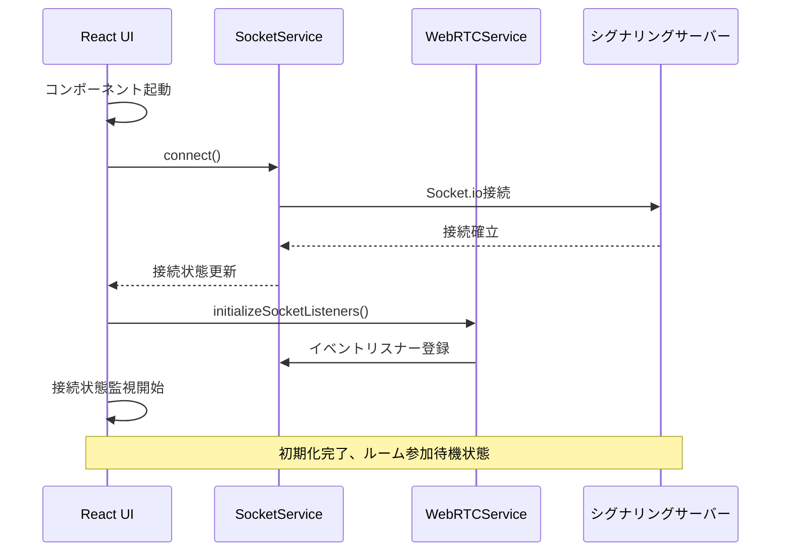

### 2. ルーム参加とメディア取得フロー

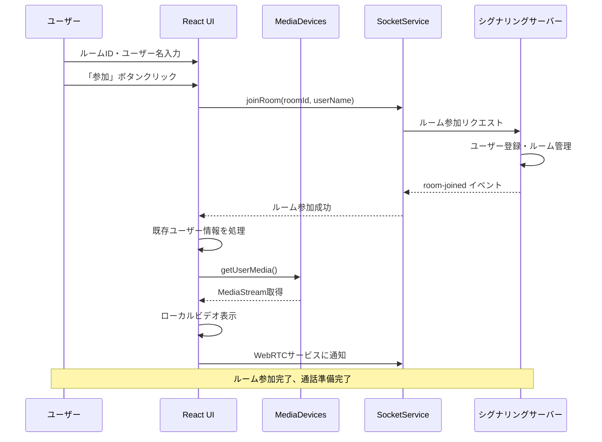

### 3. WebRTC接続確立フロー（Offer/Answer）

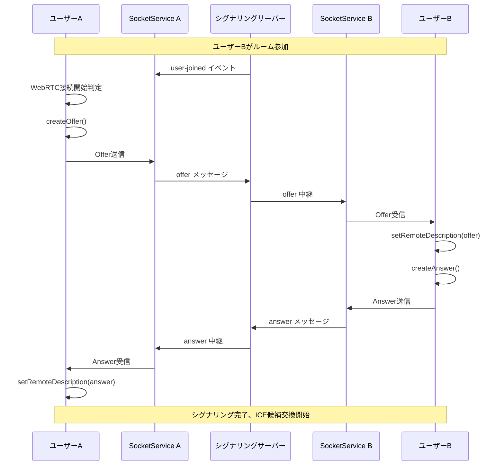

### 4. ICE候補交換とP2P接続確立

```mermaid
sequenceDiagram
    participant A as ユーザーA
    participant STUN as STUNサーバー
    participant Server as シグナリングサーバー
    participant B as ユーザーB
    
    Note over A,B: Offer/Answer交換完了後
    
    A->>STUN: STUN リクエスト
    STUN-->>A: パブリックIP取得
    A->>A: ICE候補生成
    A->>Server: ICE候補送信
    Server->>B: ICE候補中継
    B->>B: addIceCandidate()
    
    B->>STUN: STUN リクエスト
    STUN-->>B: パブリックIP取得
    B->>B: ICE候補生成
    B->>Server: ICE候補送信
    Server->>A: ICE候補中継
    A->>A: addIceCandidate()
    
    Note over A,B: 最適な通信経路を選択
    A<-.->B: P2P接続確立
    A<-.->B: メディアストリーム送受信開始
    
    Note over A,B: ビデオ通話開始
```

### 5. リアルタイムチャット機能フロー

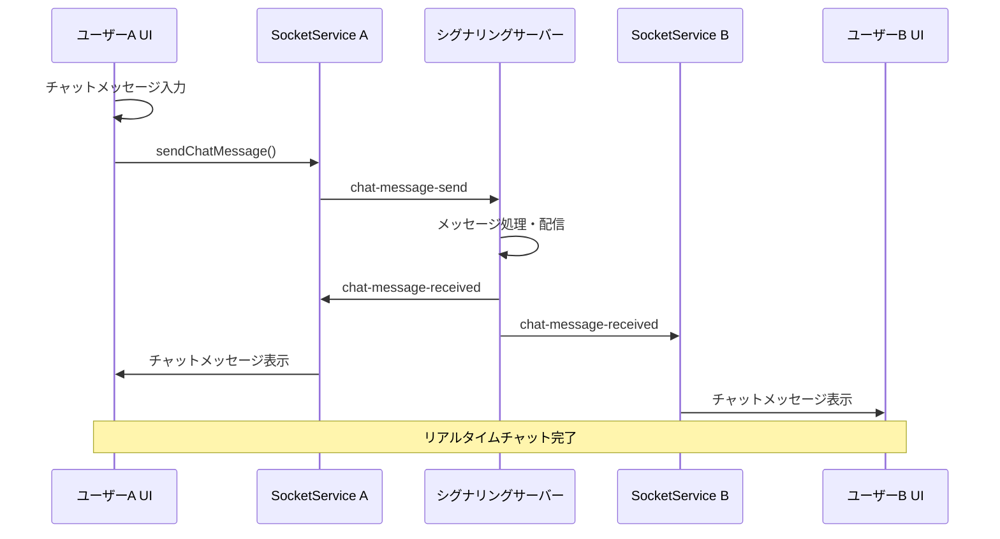

### 6. エラーハンドリングとリカバリフロー

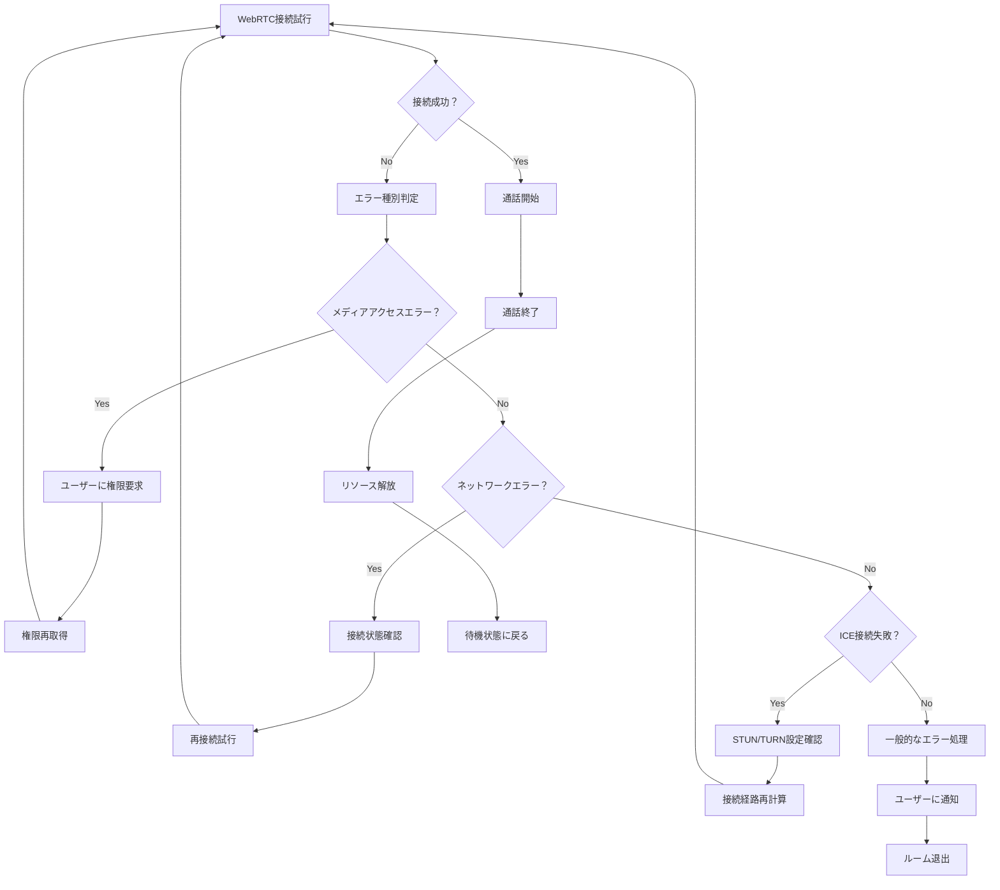

### 7. データフローの概要

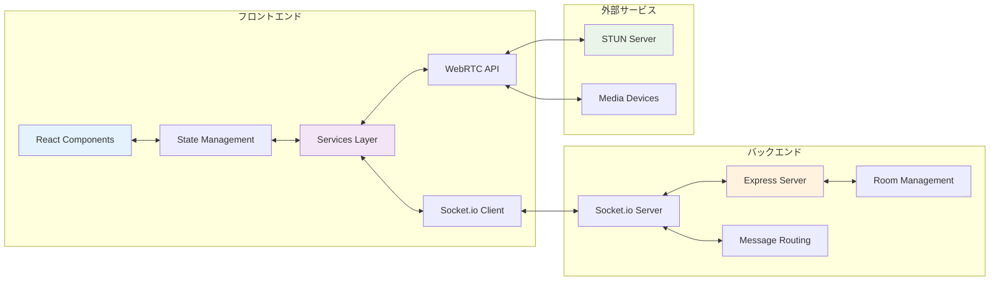

## 🔧 WebRTC開発のポイント

### HTTPS要件
WebRTCはHTTPS環境でのみ動作します。開発環境でHTTPS設定が必要な場合：

```bash
# mkcertを使用してローカル証明書を作成
brew install mkcert
mkcert -install
mkcert localhost
```

### STUN/TURNサーバー
- 開発環境: Google Public STUN (`stun:stun.l.google.com:19302`)
- 本番環境: 専用TURN/STUNサーバーの構築を推奨

### ブラウザサポート
- Chrome 23+
- Firefox 22+
- Safari 11+
- Edge 13+

## 🎥 ビデオ通話アプリの使用方法

### 基本的な使い方

1. **サーバーの起動**
   ```bash
   npm run dev
   ```

2. **アプリケーションへのアクセス**
   - フロントエンド: http://localhost:5173
   - バックエンド: http://localhost:3001

### 1対1ビデオ通話のテスト

1. **2つのブラウザタブ**を開きます（または2つの異なるブラウザ）

2. **両方で**以下の手順を実行：
   - http://localhost:5173 にアクセス
   - **同じルームID**を入力（例：`test-room`）
   - **異なるユーザー名**を入力（例：`ユーザー1`、`ユーザー2`）
   - カメラ・マイクのアクセス許可を承認
   - 「参加する」をクリック

3. **通話開始**
   - 片方のユーザーで参加者リストの「📞 通話」ボタンをクリック
   - WebRTC接続が自動的に開始されます

### 期待される動作
- ✅ 自分のビデオが左側に表示（ミラー効果）
- ✅ 相手のビデオが右側に表示
- ✅ 音声通話も同時に動作
- ✅ 参加者リストに両方のユーザーが表示
- ✅ 接続状態インジケーターが緑色で表示

### トラブルシューティング

#### カメラ・音声関連
- **カメラが表示されない**: ブラウザの設定でカメラアクセスを許可
- **音声が聞こえない**: ブラウザの音量設定とマイクアクセスを確認
- **映像が暗い**: 照明環境を確認

#### 接続関連
- **「切断中」と表示される**: バックエンドサーバーが起動しているか確認
- **通話が始まらない**: 同じルームIDに参加しているか確認
- **映像が途切れる**: ネットワーク環境を確認

#### デバッグ方法
1. **ブラウザの開発者ツール**でコンソールログを確認
2. **ネットワークタブ**でWebSocket接続を確認
3. **バックエンドのターミナル**でSocket.ioのログを確認

#### トラブルシューティングフローチャート

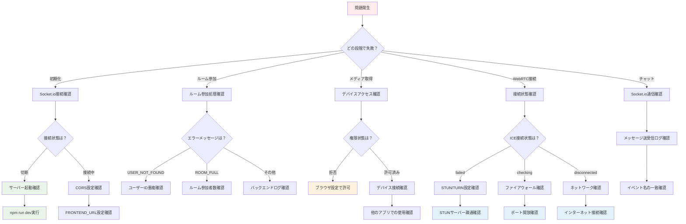

#### 各段階での期待されるログ出力

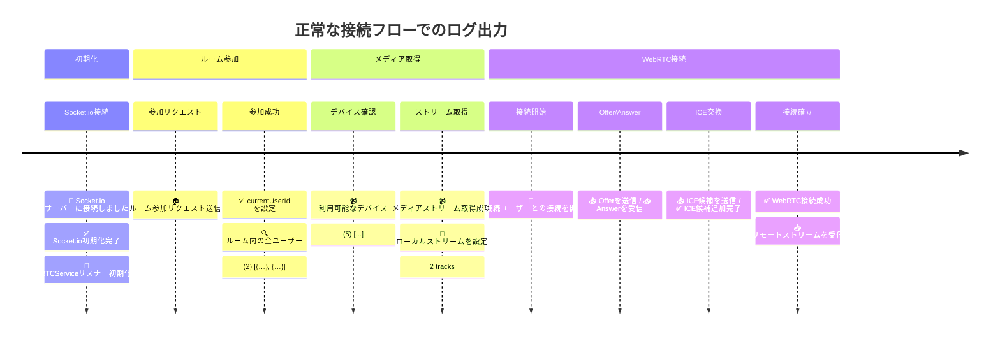

### アプリケーションの特徴

- **P2P通信**: サーバーを経由せず直接通信
- **自動シグナリング**: Socket.ioによる接続協調
- **NAT穿越**: STUNサーバーによる接続支援
- **レスポンシブUI**: モバイル端末にも対応

### 実際の処理フロー例（2人のユーザーがビデオ通話を開始する場合）

```mermaid
gantt
    title WebRTCビデオ通話の時系列処理
    dateFormat X
    axisFormat %L
    
    section 初期化
    サーバー起動           :0, 1000
    ユーザーA アクセス      :1000, 1500
    ユーザーB アクセス      :2000, 2500
    
    section ルーム参加
    ユーザーA ルーム参加    :1500, 2000
    ユーザーA メディア取得  :2000, 3000
    ユーザーB ルーム参加    :2500, 3000
    ユーザーB メディア取得  :3000, 4000
    
    section WebRTC接続
    Offer/Answer交換       :4000, 5000
    ICE候補交換           :5000, 6000
    P2P接続確立           :6000, 6500
    
    section 通話開始
    ビデオ通話開始         :6500, 10000
```

### 主要コンポーネント間の責任分担

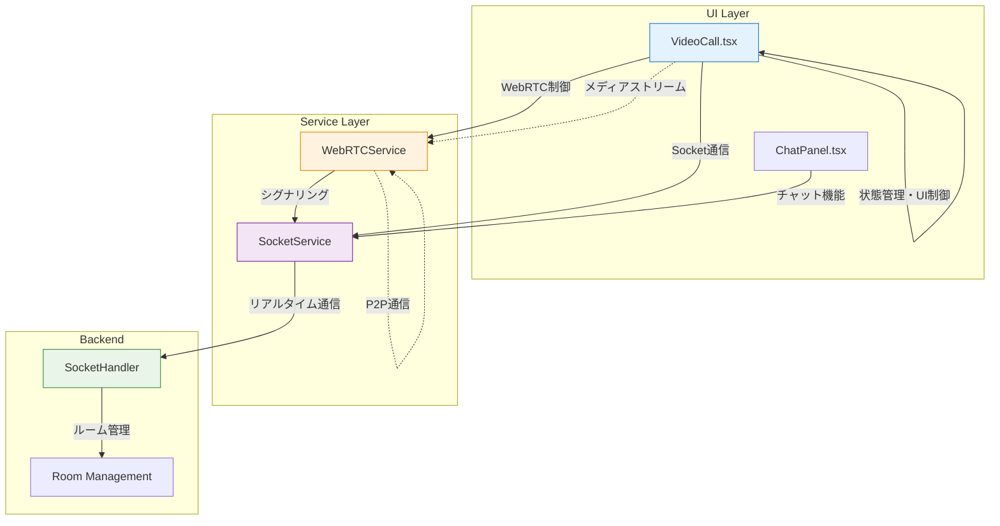

### デバッグ時の主要ログポイント

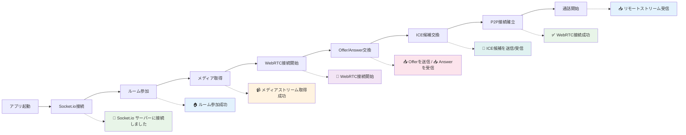

## 📊 開発フロー

1. **機能実装**
   - 型定義の更新
   - コンポーネント/サービスの実装
   - テストの作成

2. **テスト実行**
   ```bash
   npm run test:all
   ```

3. **ビルド確認**
   ```bash
   npm run build:all
   ```

4. **CI/CD**
   - GitHub Actions による自動テスト
   - セキュリティ監査
   - 品質チェック

## 🚨 トラブルシューティング

### よくある問題

1. **ポート競合**
   ```bash
   lsof -i :3001  # ポート使用状況確認
   ```

2. **WebRTC接続失敗**
   - HTTPS環境の確認
   - ファイアウォール設定の確認
   - STUN/TURNサーバーの動作確認

3. **Socket.io接続エラー**
   - CORS設定の確認
   - バックエンドサーバーの起動状況確認

### ログの確認

```bash
# バックエンドログ
cd backend && npm run dev

# フロントエンド開発者ツール
# ブラウザの開発者ツール → Console タブ
```

## 📝 コーディング規約

プロジェクトの詳細な開発ルールは `.cursorrules` ファイルを参照してください。

主なポイント：
- TypeScriptの厳密な型チェック
- ESLintによるコード品質管理
- Jestによる包括的なテスト
- GitHub Actionsによる継続的インテグレーション

## 🤝 コントリビューション

1. フィーチャーブランチを作成
2. 変更を実装
3. テストを実行して通過することを確認
4. プルリクエストを作成

## 📄 ライセンス

このプロジェクトはMITライセンスの下で公開されています。

---

## 🔗 関連リンク

- [WebRTC API Documentation](https://developer.mozilla.org/en-US/docs/Web/API/WebRTC_API)
- [Socket.io Documentation](https://socket.io/docs/)
- [React Documentation](https://react.dev/)
- [Node.js Documentation](https://nodejs.org/docs/)
